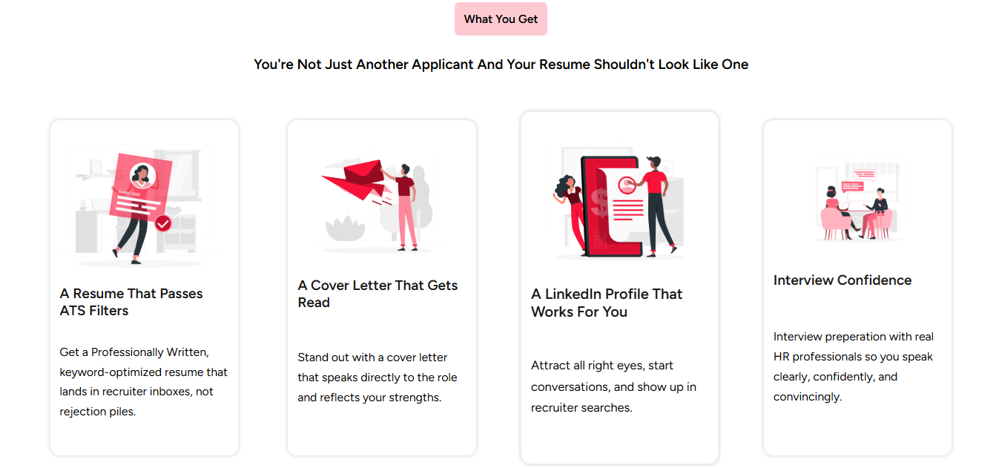

# Frontend Assignment - Infotech Wizard

This project is a front-end assignment given by **Infotech Wizard**.  
The task was to convert a given **Figma design** into a **pixel-perfect, responsive static webpage** using only **HTML and CSS**.

---

## 🚀 Live Demo
🔗 [View Live on GitHub Pages]( https://kaustubh-dalvi1001.github.io/frontend-assignment-infotechwizard/)

---

## 📌 Assignment Requirements
- Convert the provided **Figma design** into a **static HTML/CSS file**.
- Ensure the design is **pixel-perfect** compared to the Figma file.
- Make the layout **fully responsive** across **desktop, tablet, and mobile**.
- Write **clean, maintainable, and semantic code**.

---

## 🛠️ Tech Stack
- **HTML5**
- **CSS3**
- **Responsive Design**

---

## 📂 Project Structure
```plaintext
├── index.html # Main HTML file
├── style.css # CSS styling
└── images/ # Assets (images/icons)
```

---

## 📸 Preview
  
  
  

---

## 👨‍💻 Author
**Kaustubh Dalvi**  
- [GitHub](https://github.com/Kaustubh-Dalvi1001)  
- [LinkedIn](https://www.linkedin.com/in/kaustubh-dalvi-0431662a8)  